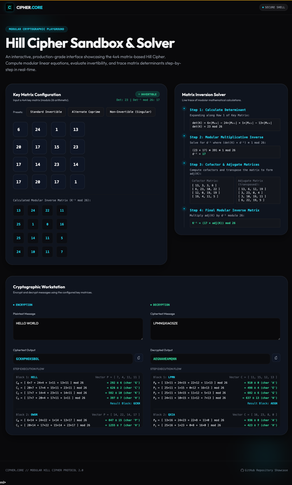

# Cipher.Core — Hill Cipher Sandbox & Solver

An interactive web playground and Java reference implementation of the **Hill cipher**, a classical
polygraphic substitution cipher built on linear algebra over modular arithmetic. Configure a 4×4 key
matrix, encrypt and decrypt messages, and watch every step of the modular matrix inversion render in
real time.

**Live demo → https://cipher-core-mocha.vercel.app**



---

## What it does

- **Interactive 4×4 key matrix** — type your own key or load presets (invertible, alternate coprime, singular).
- **Live invertibility check** — computes the determinant mod 26 and tells you *why* a key is or isn't usable.
- **Step-by-step modular inversion** — determinant → multiplicative inverse → adjugate → inverse matrix, traced visually.
- **Encrypt / decrypt workstation** — block-by-block transformation with the full execution flow shown for each step.
- **Java CLI reference** — the original command-line implementation the web version is modeled on.

## Why the Hill cipher

The Hill cipher is a clean, tangible way to show how **linear algebra underpins cryptography**.
Encryption is matrix–vector multiplication mod 26; decryption requires the **modular multiplicative
inverse** of the key matrix, which only exists when the matrix determinant is coprime with 26. This
project makes that math interactive instead of abstract.

### The math, briefly

| Step | Operation |
|------|-----------|
| Encrypt | `C = (K · P) mod 26` — key matrix `K` times plaintext block `P` |
| Invertibility | `K⁻¹` exists ⟺ `gcd(det(K), 26) = 1` |
| Decrypt | `P = (K⁻¹ · C) mod 26` — where `K⁻¹ = det(K)⁻¹ · adj(K) mod 26` |

Plaintext is padded with `X` to a multiple of the block size (4).

## Run it

### Web playground (no build)

```bash
# any static server works
python3 -m http.server 8000
# then open http://localhost:8000
```

Or just open the deployed version: **https://cipher-core-mocha.vercel.app**

### Java CLI reference

```bash
javac HillCipher.java
java HillCipher
# Enter the 4x4 key matrix (row-wise): 6 24 1 13 20 17 15 23 17 14 23 14 17 20 17 1
# Enter the plaintext (uppercase letters only): HELLO
```

## Project structure

```
.
├── index.html          # App shell + layout (Tailwind via CDN)
├── app.js              # Cipher engine + interactive UI logic
├── style.css           # Design system: glassmorphism, theme tokens
├── HillCipher.java     # Original Java CLI implementation
├── assets/             # Logo, favicons, OG image, screenshot
├── site.webmanifest    # PWA manifest
└── favicon.ico
```

## Tech

- **Frontend:** vanilla JavaScript, HTML, Tailwind CSS (CDN)
- **Reference impl:** Java (matrix ops, modular arithmetic, cofactor expansion)
- **Hosting:** Vercel (static)
- **Design:** custom dark theme — obsidian background, neon-cyan accent, glassmorphism

## Notes & limitations

- The Hill cipher is a **teaching cipher**, not a secure modern cryptosystem. It is vulnerable to
  known-plaintext attacks because the transformation is linear. This project exists to make the
  underlying linear algebra visible and intuitive, not to secure real data.
- The web playground is the primary, fully interactive artifact; `HillCipher.java` is the original
  command-line version it grew from.

## License

[MIT](LICENSE) © Eduardo Canelas
